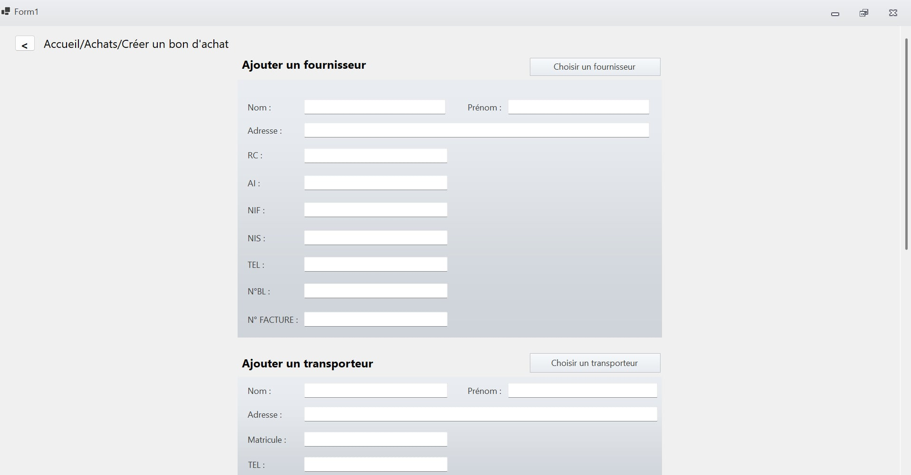
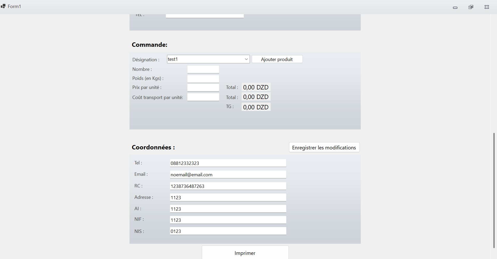

# StockIt 2

A comprehensive stock management and invoicing desktop application built for small businesses, specifically tailored for Algerian business requirements.

##  Overview

StockIt 2 is a Windows Forms desktop application developed in C# with .NET 9.0, designed to streamline stock management, supplier relations, and invoice generation for small to medium-sized businesses. The application features a modern UI with the Krypton Toolkit and provides offline functionality through SQLite database storage.

##  Architecture

### Technology Stack

- **.NET Framework**: .NET 9.0 Windows Forms
- **Language**: C# 
- **Database**: SQLite (Microsoft.Data.Sqlite.Core + SQLitePCLRaw)
- **UI Framework**: Windows Forms with Krypton Toolkit
- **PDF Generation**: QuestPDF
- **Architecture Pattern**: Model-View-Controller (MVC) with Service Layer

### Project Structure

```
StockIt-2/
├── models/                 # Data models and database management
│   ├── data.db            # SQLite database file
│   ├── stock_it_uml.drawio # UML architecture diagram
│   └── [Model classes]    # Bon, Bon_item, Fournisseur, Transporteur, etc.
├── controllers/           # MVC controllers and navigation
│   ├── NavigationMaster.cs # Central navigation management
│   ├── InvoiceDocument.cs  # PDF document generation
│   └── [UI components]    # FournisseurComponent, TransporteurComponent
├── services/              # Business logic and data access layer
│   ├── GestionFournisseurs.cs
│   ├── GestionBon.cs
│   ├── GestionProduit.cs
│   ├── GestionTransporteurs.cs
│   ├── GestionCoords.cs
│   └── GestionParticulier.cs
├── view/                  # User interface layer
│   ├── Forms/             # Main application windows
│   │   ├── Form1.cs       # Main application form
│   │   ├── AjouterProduit.cs
│   │   ├── choisir_fournisseur.cs
│   │   └── [Other forms]
│   └── User Controls/     # Reusable UI components
│       ├── uc_accueil.cs     # Home screen
│       ├── uc_achats.cs      # Purchases management
│       ├── uc_bon.cs         # Delivery note management
│       └── [Other controls]
├── documentation.docx     # Additional project documentation
└── [Resource files]      # .resx files for UI resources
```

### Architecture Layers

1. **Models Layer**: Data entities and database connection management
2. **Controllers Layer**: Navigation management and UI component controllers
3. **Services Layer**: Business logic and data access operations
4. **View Layer**: Windows Forms and user controls

##  Features

### Core Business Features
<p align="center">   </p>

####  Supplier Management
- Create, read, and update supplier information
- Store legal identifiers (RC, AI, NIF, NIS) specific to Algerian businesses
- Contact information and address management
- Supplier search and filtering capabilities

####  Transport Management
- Transport provider registration and management
- Cost calculation per transport unit
- Integration with delivery note generation

####  Product Management
- Product catalog with designations and specifications
- Inventory tracking and management
- Product search and categorization

####  Delivery Note & Invoice Management
- Generate delivery notes ("Bon de récéption")
- Itemized billing with quantities, weights, and unit prices
- Transport cost integration
- Professional PDF invoice generation with QuestPDF
- Customizable document templates

####  Company Information Management
- Store and manage company contact details
- Legal and tax information management
- Company branding integration in documents

### Technical Features

- **Offline-First Architecture**: Local SQLite database ensures operation without internet connectivity
- **Modern UI**: Enhanced Windows Forms with Krypton Toolkit components
- **Professional Documents**: High-quality PDF generation for invoices and delivery notes
- **Navigation System**: Centralized UI navigation with history tracking
- **French Language Support**: Complete French interface optimized for Algerian business context
- **Algerian Dinar (DZD)**: Localized currency support

##  Development Setup

### Prerequisites

- **Visual Studio 2022** (version 17.14 or later)
- **.NET 9.0 SDK**
- **Windows Operating System** (Windows 10 or later)
- **SQLite support** (included with dependencies)

### Installation

1. **Clone the repository**
   ```bash
   git clone <repository-url>
   cd StockIt-2
   ```

2. **Open in Visual Studio**
   - Launch Visual Studio 2022
   - Open the `StockIt-2.csproj` file
   - Restore NuGet packages (automatically prompted)

3. **Build the application**
   ```bash
   dotnet build
   ```

4. **Run the application**
   ```bash
   dotnet run
   ```

### Dependencies

| Package | Version | Description |
|---------|---------|-------------|
| Krypton.Toolkit | 95.25.8.235 | Enhanced Windows Forms UI components |
| Microsoft.Data.Sqlite.Core | 9.0.7 | SQLite database provider |
| QuestPDF | 2025.7.0 | PDF generation library |
| SQLitePCLRaw.bundle_e_sqlite3 | 2.1.11 | SQLite native libraries |
| System.Data.SQLite.EF6 | 1.0.119 | Entity Framework support for SQLite |

##  Database Schema

### Core Tables

- **`fournisseurs`** - Supplier information and legal details
- **`testing`** - Development and testing data
- **Additional tables** for products, transport, delivery notes, and company information

### Key Entities

- **Bon**: Delivery note/invoice entity
- **Bon_item**: Line items within delivery notes
- **Fournisseur**: Supplier information
- **Transporteur**: Transport provider details
- **Produit**: Product catalog
- **Coords**: Company contact information
- **Particulier**: Individual customer records

##  Configuration

### Database Setup
- SQLite database file is automatically created at `models/data.db`
- No external configuration required for basic setup
- Database schema is managed through the Services layer

### Application Settings
- Configuration is embedded within the application code
- QuestPDF license is initialized in `Program.cs`
- No external config files needed for deployment

##  Usage Flow

1. **Application Startup**
   - Launch `Form1` (main application window)
   - SQLite database initialization
   - Load home screen (`uc_accueil`)

2. **Core Workflow**
   - **Home Screen** (`uc_accueil`) → Main navigation
   - **Purchases** (`uc_achats`) → Supplier and product selection
   - **Delivery Note Creation** (`uc_bon`) → Document generation
   - **PDF Export** → Professional invoice generation

3. **Navigation**
   - Centralized navigation through `NavigationMaster`
   - Navigation history tracking
   - Seamless switching between functional modules

##  Deployment

### Build Configuration
- **Output Type**: Windows Executable (WinExe)
- **Target Framework**: .NET 9.0 Windows
- **Self-contained deployment** supported

### Distribution
- Compile to executable file
- Include SQLite database file
- No external dependencies required
- Compatible with Windows 10 and later

##  Documentation

- **UML Diagram**: Available at `models/stock_it_uml.drawio`
- **Additional Documentation**: `documentation.docx` contains detailed project specifications
- **Code Comments**: Inline documentation in French throughout the codebase

##  Localization

- **Primary Language**: French
- **Business Context**: Algerian business regulations and practices
- **Currency**: Algerian Dinar (DZD)
- **Tax Identifiers**: RC, AI, NIF, NIS (Algerian tax codes)

##  Security & Privacy

- **Local Data Storage**: All business data stored locally in SQLite database
- **No External Dependencies**: No data transmission to external services
- **Offline Operation**: Complete functionality without internet connectivity

##  Contributing

1. Fork the repository
2. Create a feature branch (`git checkout -b feature/AmazingFeature`)
3. Commit your changes (`git commit -m 'Add some AmazingFeature'`)
4. Push to the branch (`git push origin feature/AmazingFeature`)
5. Open a Pull Request

##  License

This project is licensed under the MIT License - see the LICENSE file for details.

##  Support

For support and questions:
- Review the documentation in `documentation.docx`
- Check the UML diagram in `models/stock_it_uml.drawio`
- Examine the code comments for specific implementation details

---

**StockIt 2** - Professional stock management simplified for Algerian businesses.
